# 🌐 Coerência Wavelet Ionosfera × Elétricos – Araguatins (ARG) – Agosto 2017

Este repositório contém scripts MATLAB para calcular a **Coerência Wavelet Contínua (WCOH)** entre parâmetros **ionosféricos** e **elétricos (Vd_mean, Vd_storm, Vd_total, PPEF, DDEF)** na estação **Araguatins (TO)** durante **agosto de 2017**.

O objetivo é investigar o acoplamento espectral entre a ionosfera e perturbações eletrodinâmicas.

---

## 🛠 Tecnologias Usadas

- **MATLAB (R2019b ou superior)**
- **Wavelet Toolbox**
- Arquivos `.mat` com parâmetros ionosféricos (5 min)
- Arquivo `drift.dat` com parâmetros elétricos (15 min)

 

---

## 📊 Dados Utilizados

- **Parâmetros Ionosféricos (5 min)**: `foF2`, `hF`, `hmF2`
- **Parâmetros Elétricos (15 min)**: `Vd_mean`, `Vd_storm`, `Vd_total`, `PPEF`, `DDEF`

---

💡 Objetivo

- Aplicar análise de **coerência wavelet contínua (WCOH)** para identificar padrões espectro-temporais e períodos dominantes em séries temporais de parâmetros **ionosféricos** (`foF2`, `hF`, `hmF2`) e **elétricos** (`Vd_mean`, `Vd_storm`, `Vd_total`, `PPEF`, `DDEF`) medidos na estação **Araguatins (TO)** durante **agosto de 2017**.

---

## 📂 Estrutura do Projeto

```
wcoh_arg/
├── dados/
│ ├── mediasionosfericasARG.mat
│ └── drift.dat
├── images/
│ ├── WCOH_ARG_foF2_PPEF.png
│ ├── WCOH_ARG_hmF2_Vd_total.png
│ └── ...
├── wav_fejer_arg_com_vd.m
└── README.md
```

---

## ⚙️ Como Executar

1. Clone o repositório:

```bash
git clone https://github.com/lauratrigo/Wavelet_Coherence_Araguatins.git
cd wcoh-arg
```
2. Abra o MATLAB, certifique-se de que os arquivos .mat e drift.dat estão na pasta dados/.

3. Execute:
```bash
run wav_fejer_arg_com_vd.m
```
Os gráficos serão salvos em images/.

---

## 📈 Gráficos Gerados

<!-- h'F -->
<div align="center">
  <h4><strong>h'F × Vd_mean</strong></h4>
  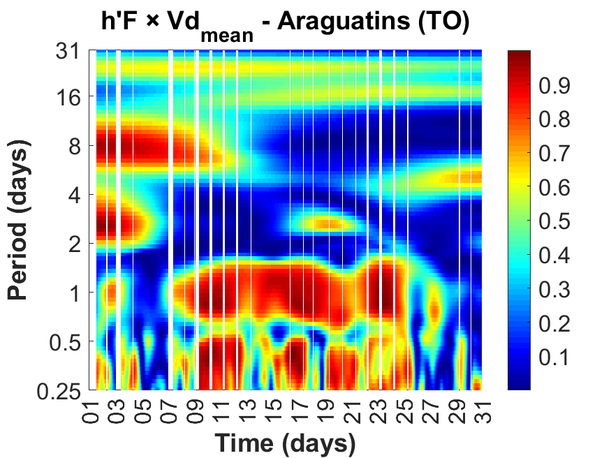
</div>
<div align="center">
  <h4><strong>h'F × Vd_storm</strong></h4>
  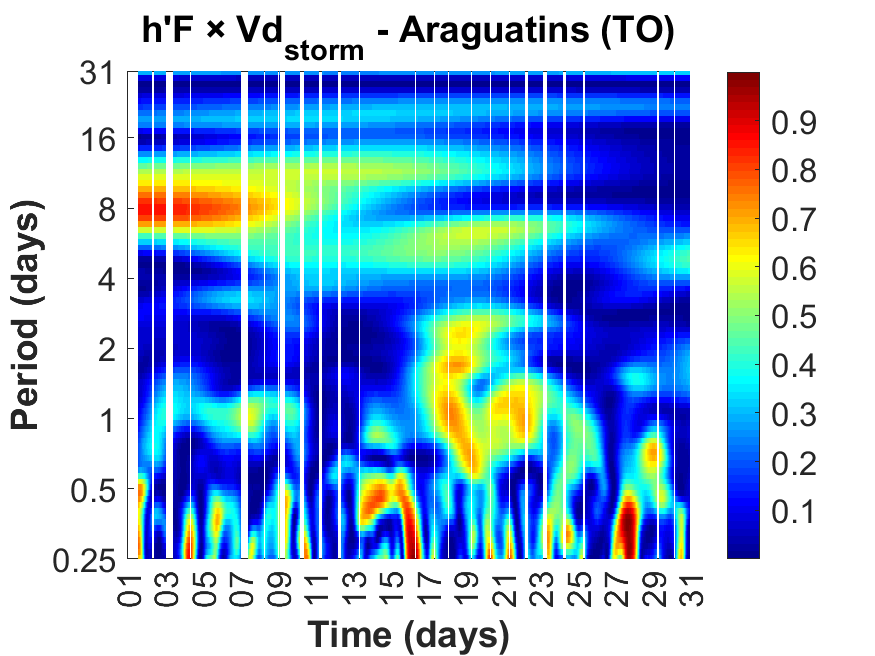
</div>
<div align="center">
  <h4><strong>h'F × Vd_total</strong></h4>
  
</div>
<div align="center">
  <h4><strong>h'F × PPEF</strong></h4>
  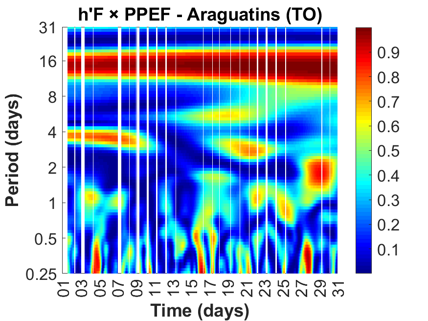
</div>
<div align="center">
  <h4><strong>h'F × DDEF</strong></h4>
  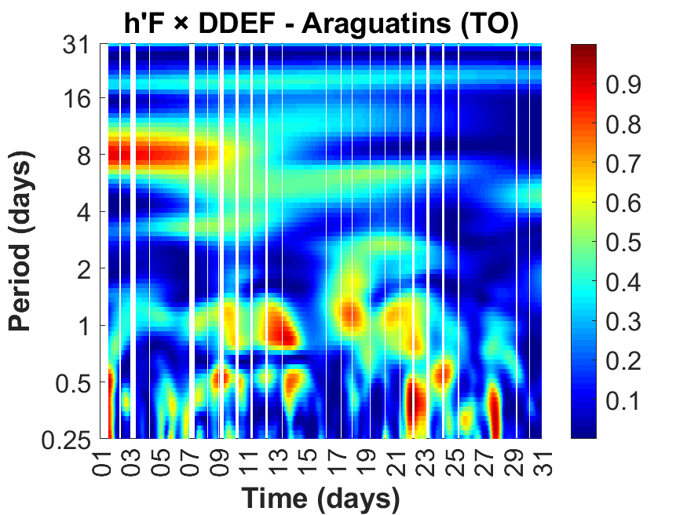
</div>

<!-- hmF2 -->
<div align="center">
  <h4><strong>hmF2 × Vd_mean</strong></h4>
  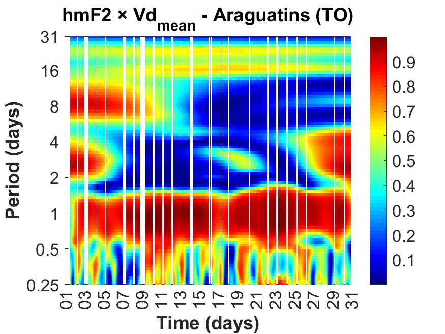
</div>
<div align="center">
  <h4><strong>hmF2 × Vd_storm</strong></h4>
  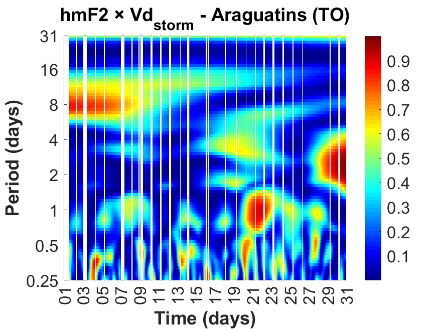
</div>
<div align="center">
  <h4><strong>hmF2 × Vd_total</strong></h4>
  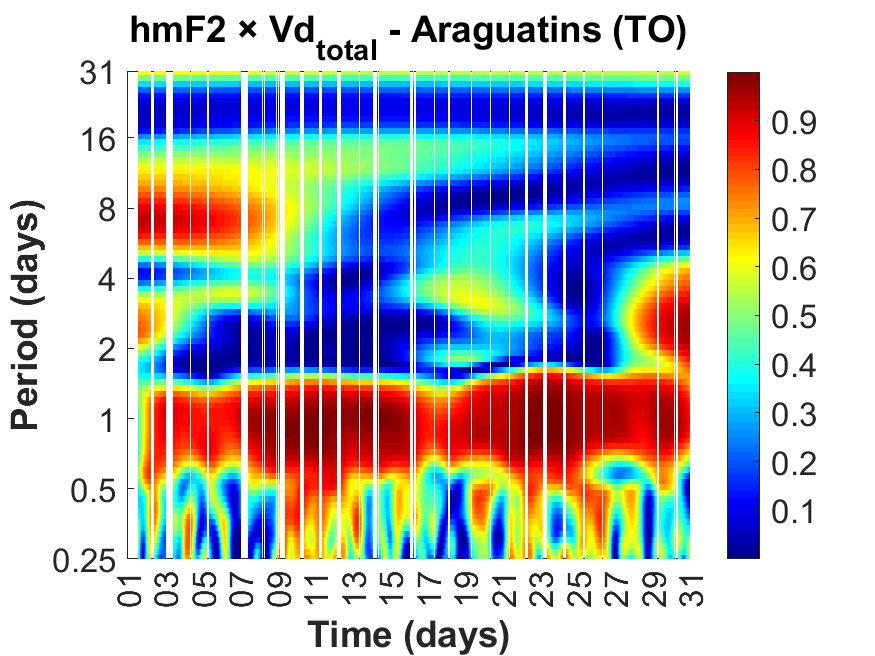
</div>
<div align="center">
  <h4><strong>hmF2 × PPEF</strong></h4>
  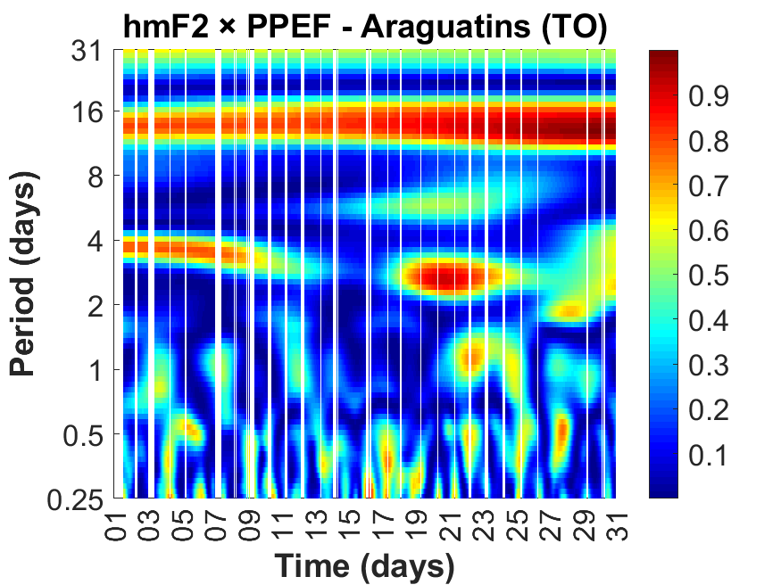
</div>
<div align="center">
  <h4><strong>hmF2 × DDEF</strong></h4>
  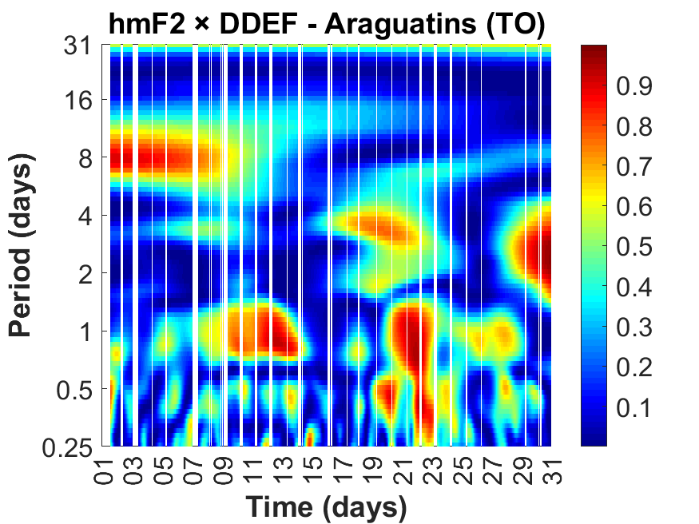
</div>

<!-- foF2 -->
<div align="center">
  <h4><strong>foF2 × Vd_mean</strong></h4>
  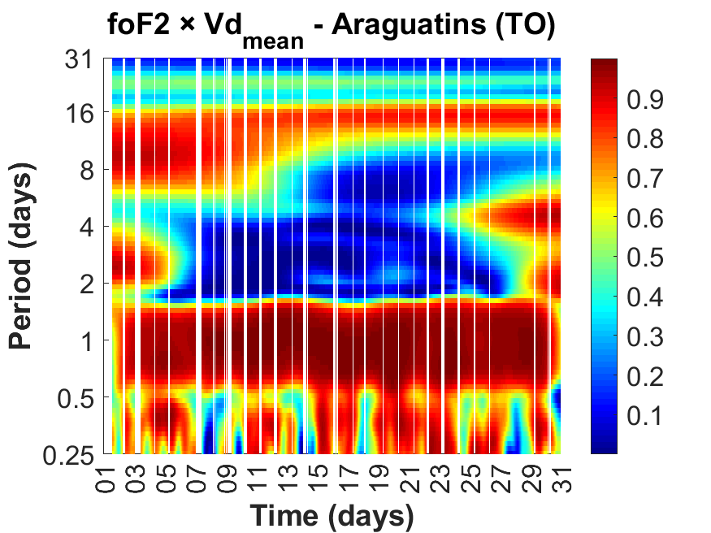
</div>
<div align="center">
  <h4><strong>foF2 × Vd_storm</strong></h4>
  
</div>
<div align="center">
  <h4><strong>foF2 × Vd_total</strong></h4>
  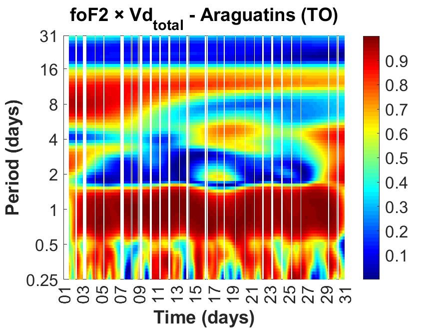
</div>
<div align="center">
  <h4><strong>foF2 × PPEF</strong></h4>
  
</div>
<div align="center">
  <h4><strong>foF2 × DDEF</strong></h4>
  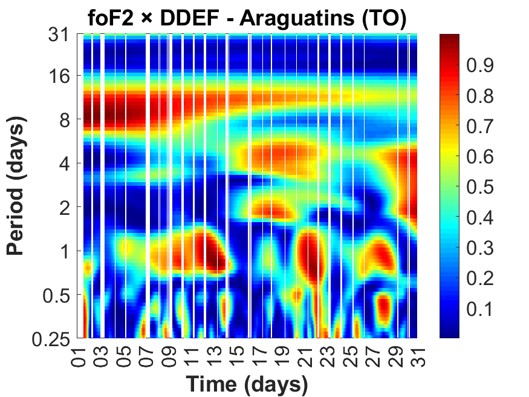
</div>

---

## 🤝 Agradecimentos

Este projeto foi desenvolvido como parte de um trabalho de pesquisa em Física Espacial no IP&D/UNIVAP, com apoio do grupo de estudos em ionosfera e geomagnetismo.

---

## 📜 Licença

Este repositório está licenciado sob **MIT License**. Consulte o arquivo LICENSE para mais informações.

